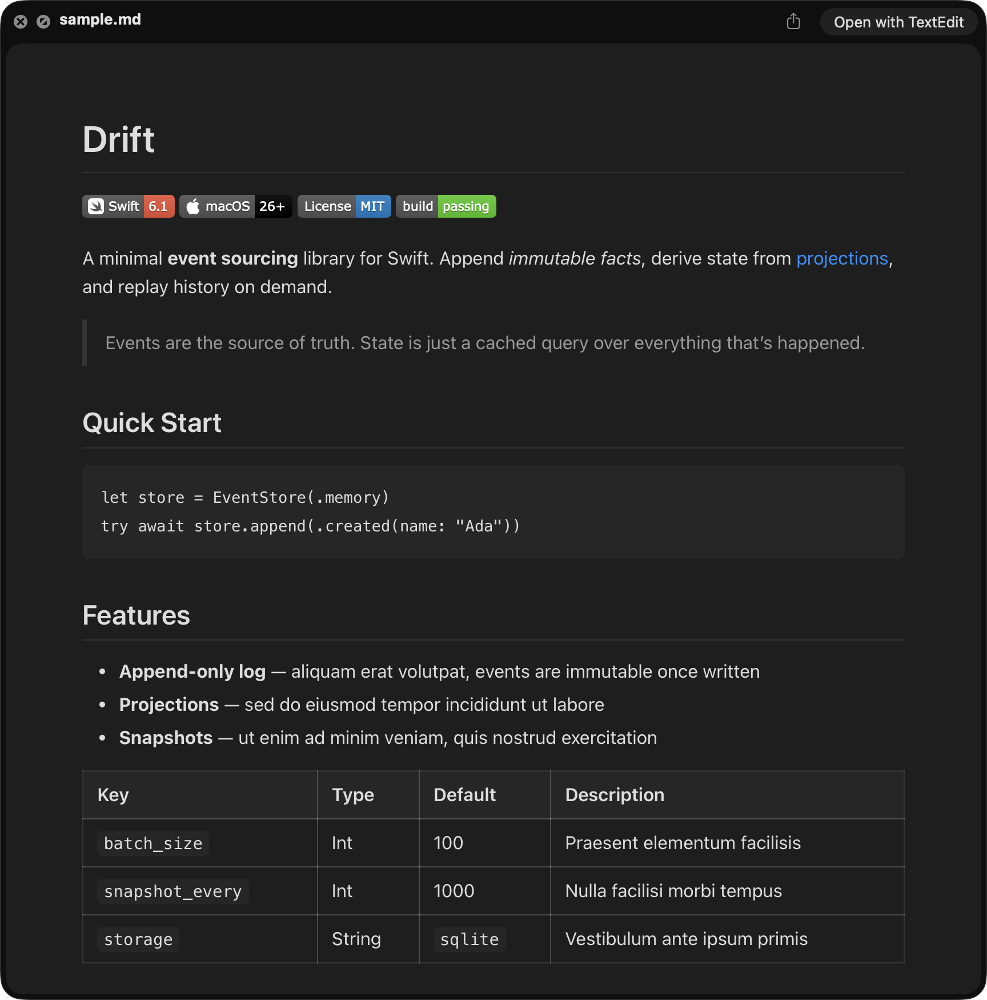

# Glance


A macOS QuickLook extension for Markdown files. Select a `.md` file in Finder, press Space, and get a rendered preview.



## What it does

Glance registers as a QuickLook preview handler for Markdown files. It parses Markdown using Apple's [swift-markdown](https://github.com/apple/swift-markdown) library, converts it to styled HTML, and renders it in a lightweight WebView — all inside the standard QuickLook panel.

Supports headings, lists, task lists, code blocks, tables, blockquotes, images, links, emphasis, strikethrough, and horizontal rules. Relative images are resolved and embedded inline. Links open in the default browser. Light and dark mode are handled automatically via native system colors.

## How it works

Glance.app is a minimal shell — it exists because macOS requires app extensions to be embedded inside an app bundle. The actual work happens in the QuickLook Preview Extension bundled inside it.

When the app is installed and launched for the first time, macOS scans the bundle and registers the embedded extension with PlugInKit (the system's extension discovery service). PlugInKit reads the extension's `Info.plist` to learn which content types it handles, then spawns the extension on demand whenever QuickLook needs to preview a matching file and tears it down when the panel closes.

The extension registers for two UTIs (Uniform Type Identifiers): `net.daringfireball.markdown` — the original identifier, named after John Gruber's site where Markdown was created — and `public.markdown`, the newer Apple-standardized UTI. Which one the system assigns to a given `.md` file depends on macOS version and what apps have touched it, so both are registered to catch all Markdown files.

The app bundle is ~3 MB. There is no background process, no menu bar icon, no dock presence beyond the initial launch. Zero resource usage when not in use.

## Setup

### Build from source

Requires Xcode and a valid Apple Developer signing identity (app extensions must be properly signed). Open the project in Xcode and set the development team for both the `Glance` and `GlancePreview` targets before building.

```sh
make build
make install
open /Applications/Glance.app
```

This builds a Release configuration, copies `Glance.app` to `/Applications/`, resets the QuickLook daemon, and launches the app. The initial launch is required — macOS registers the embedded QuickLook extension with PlugInKit on first run. The app can be closed immediately after.

When signed with a development identity, Gatekeeper will prompt to confirm on first launch. Accept once and it won't ask again.

### Verify

```sh
qlmanage -p /path/to/some/file.md
```

Or select any `.md` file in Finder and press Space.

### Uninstall

Delete `/Applications/Glance.app` and reset QuickLook:

```sh
rm -rf /Applications/Glance.app
qlmanage -r
```
