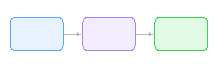

# Drift


A minimal **event sourcing** library for Swift. Append *immutable facts*, derive state from [projections](https://example.com/docs), and replay history on demand.

> Events are the source of truth. State is just a cached query over everything that's happened.

## Quick Start

```swift
let store = EventStore(.memory)
try await store.append(.created(name: "Ada"))
```

## Features

- **Append-only log** — aliquam erat volutpat, events are immutable once written
- **Projections** — sed do eiusmod tempor incididunt ut labore
- **Snapshots** — ut enim ad minim veniam, quis nostrud exercitation

| Key | Type | Default | Description |
|-----|------|---------|-------------|
| `batch_size` | Int | 100 | Praesent elementum facilisis |
| `snapshot_every` | Int | 1000 | Nulla facilisi morbi tempus |
| `storage` | String | `sqlite` | Vestibulum ante ipsum primis |

## Status

- [x] In-memory event store
- [x] SQLite persistence
- [ ] Subscription API
- [ ] Snapshot compaction

### Replay Lifecycle

1. **Load** — open the event log
2. **Replay** — apply events to rebuild state
3. **Subscribe** — listen for new events
4. **Compact** — snapshot and trim old entries

---



Donec ullamcorper nulla non metus auctor fringilla. See the [API reference](https://example.com/docs) or file an issue on [GitHub](https://example.com/issues).
